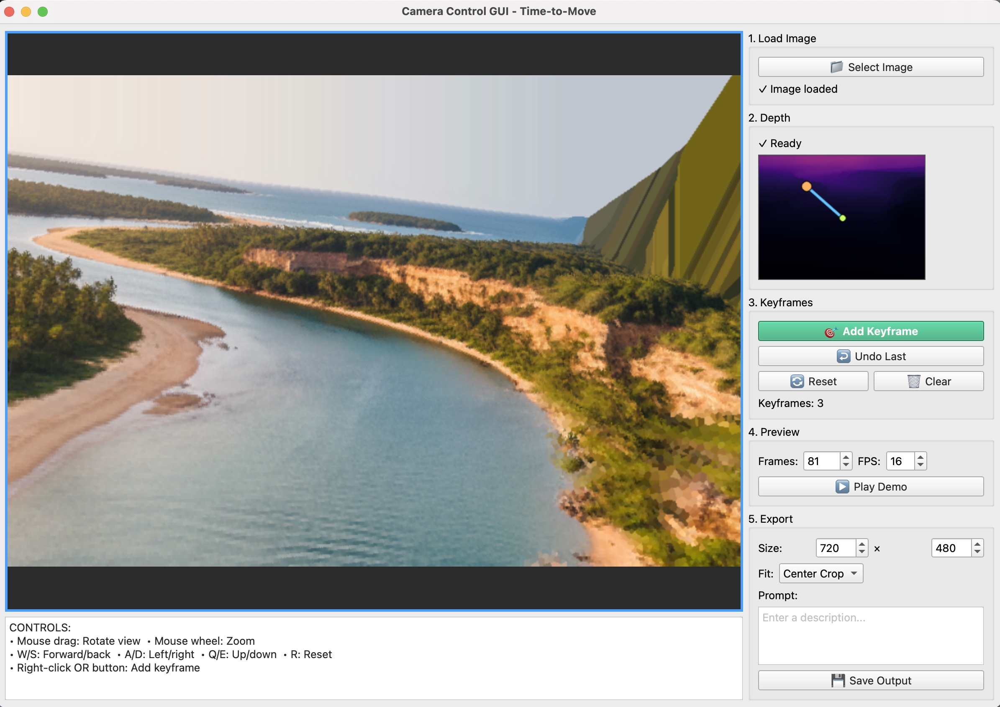

<h1 align="center">Time-to-Move</h1>
<h2 align="center">Training-Free Motion-Controlled Video Generation via Dual-Clock Denoising</h2>
<p align="center">
  <a href="https://www.linkedin.com/in/assaf-singer/">Assaf Singer</a><sup>†</sup> ·
  <a href="https://rotsteinnoam.github.io/">Noam Rotstein</a><sup>†</sup> ·
  <a href="https://www.linkedin.com/in/amir-mann-a890bb276/">Amir Mann</a> ·
  <a href="https://ron.cs.technion.ac.il/">Ron Kimmel</a> ·
  <a href="https://orlitany.github.io/">Or Litany</a>
</p>
<p align="center"><sup>†</sup> Equal contribution</p>

<p align="center"><b><span style="color:#3b82f6;">Accepted to ICLR 2026!</span></b></p>

<p align="center">
  <a href="https://time-to-move.github.io/">
    
  </a>
  <a href="https://arxiv.org/abs/2511.08633">
    
  </a>
  <a href="https://arxiv.org/pdf/2511.08633">
    
  </a>
</p>


<div align="center">
  <br/>
  <span style="color: inherit; font-family: -apple-system, BlinkMacSystemFont, 'Segoe UI', Helvetica, Arial, 'Noto Sans', sans-serif;">
    <big><strong>Warped</strong></big>&emsp;&emsp;&emsp;&emsp;&emsp;&emsp;&emsp;&emsp;
    <big><strong>Ours</strong></big>&emsp;&emsp;&emsp;&emsp;&emsp;&emsp;&emsp;&emsp;&emsp;
    <big><strong>Warped</strong></big>&emsp;&emsp;&emsp;&emsp;&emsp;&emsp;&emsp;&emsp;
    <big><strong>Ours</strong></big>
  </span>
</div>

<br>

## Table of Contents

- [News](#news)
- [Inference](#inference)
  - [Dual Clock Denoising Guide](#dual-clock-denoising)
  - [Wan](#wan)
  - [CogVideoX](#cogvideox)
  - [Stable Video Diffusion](#stable-video-diffusion)
- [Generate Your Own Cut-and-Drag Examples](#generate-your-own-cut-and-drag-examples)
- [Generate Your Own Camera-Control Examples](#generate-your-own-camera-control-examples)
- [Community Adoption](#community-adoption)
- [TODO](#todo)
- [BibTeX](#bibtex)

## News

- **Accepted to ICLR 2026!**
- **Camera-Control GUI released**: see [Generate Your Own Camera-Control Examples](#generate-your-own-camera-control-examples) and [GUI guide](GUIs/README.md).


## Inference

**Time-to-Move (TTM)** is a plug-and-play technique that can be integrated into any image-to-video diffusion model. 
We provide implementations for **Wan 2.2**, **CogVideoX**, and **Stable Video Diffusion (SVD)**.
As expected, the stronger the base model, the better the resulting videos. 
Adapting TTM to new models and pipelines is straightforward and can typically be done in just a few hours.
We **recommend using Wan**, which generally produces higher‑quality results and adheres more faithfully to user‑provided motion signals.


For each model, you can use the [included examples](./examples/) or create your own as described in
[Generate Your Own Cut-and-Drag Examples](#generate-your-own-cut-and-drag-examples).

### Dual Clock Denoising
TTM depends on two hyperparameters that start different regions at different noise depths. In practice, we do not pass `tweak` and `tstrong` as raw timesteps. Instead we pass `tweak-index` and `tstrong-index`, which indicate the iteration at which each denoising phase begins out of the total `num_inference_steps` (50 for all models).
Constraints: `0 ≤ tweak-index ≤ tstrong-index ≤ num_inference_steps`.

* **tweak-index** — when the denoising process  **outside the mask** begins.
  - Too low: scene deformations, object duplication, or unintended camera motion.
  - Too high: regions outside the mask look static (e.g., non-moving backgrounds).
* **tstrong-index** — when the denoising process **within the mask** begins. In our experience, this depends on mask size and mask quality.
   - Too low: object may drift from the intended path.
   - Too high: object may look rigid or over-constrained.


### Wan
To set up the environment for running Wan 2.2, follow the installation instructions in the official [Wan 2.2 repository](https://github.com/Wan-Video/Wan2.2). Our implementation builds on the [🤗 Diffusers Wan I2V pipeline](https://github.com/huggingface/diffusers/blob/345864eb852b528fd1f4b6ad087fa06e0470006b/src/diffusers/pipelines/wan/pipeline_wan_i2v.py) 
adapted for TTM using the I2V 14B backbone.

#### Run inference (using the included Wan examples):
```bash
python run_wan.py \
  --input-path "./examples/cutdrag_wan_Monkey" \
  --output-path "./outputs/wan_monkey.mp4" \
  --tweak-index 3 \
  --tstrong-index 7
```

#### Good starting points:
* Cut-and-Drag: tweak-index=3, tstrong-index=7
* Camera control: tweak-index=2, tstrong-index=5

<br>

<details>
  <summary><big><strong>CogVideoX</strong></big></summary><br>

  To set up the environment for running CogVideoX, follow the installation instructions in the official [CogVideoX repository](https://github.com/zai-org/CogVideo).
  Our implementation builds on the [🤗 Diffusers CogVideoX I2V pipeline](https://github.com/huggingface/diffusers/blob/main/src/diffusers/pipelines/cogvideo/pipeline_cogvideox_image2video.py), which we adapt for Time-to-Move (TTM) using the CogVideoX-I2V 5B backbone.


#### Run inference (on the included 49-frame CogVideoX example):
```bash
python run_cog.py \
  --input-path "./examples/cutdrag_cog_Monkey" \
  --output-path "./outputs/cog_monkey.mp4" \
  --tweak-index 4 \
  --tstrong-index 9
```
</details>
<br>


<details>
  <summary><big><strong>Stable Video Diffusion</strong></big></summary>
  <br>

To set up the environment for running SVD, follow the installation instructions in the official [SVD repository](https://github.com/Stability-AI/generative-models).  
Our implementation builds on the [🤗 Diffusers SVD I2V pipeline](https://github.com/huggingface/diffusers/blob/8abc7aeb715c0149ee0a9982b2d608ce97f55215/src/diffusers/pipelines/stable_video_diffusion/pipeline_stable_video_diffusion.py#L147
), which we adapt for Time-to-Move (TTM).

#### To run inference (on the included 21-frame SVD example):
```bash
python run_svd.py \
  --input-path "./examples/cutdrag_svd_Fish" \
  --output-path "./outputs/svd_fish.mp4" \
  --tweak-index 16 \
  --tstrong-index 21
```
</details>
<br>

## Generate Your Own Cut-and-Drag Examples
We provide an easy-to-use GUI for creating cut-and-drag examples that can later be used for video generation in **Time-to-Move**. We recommend reading the [GUI guide](GUIs/README.md) before using it.

<p align="center">
  
</p>

To get started quickly, create a new environment and run:
```bash
pip install PySide6 opencv-python numpy imageio imageio-ffmpeg
python GUIs/cut_and_drag.py
```
<br>

## Generate Your Own Camera-Control Examples
We provide a GUI for creating camera-control examples using depth-based 3D reprojection. The tool uses [Apple's Depth Pro](https://github.com/apple/ml-depth-pro) for metric depth estimation. See the [GUI guide](GUIs/README.md) for details.

<p align="center">
  
</p>

To get started:
```bash
pip install PySide6 opencv-python==4.10.0.82 numpy==1.26.4 imageio imageio-ffmpeg torch
pip install git+https://github.com/apple/ml-depth-pro.git
python GUIs/camera_control.py
```
<br>

## Community Adoption
- [ComfyUI – WanVideoWrapper](https://github.com/kijai/ComfyUI-WanVideoWrapper) by [@kijai](https://github.com/kijai): native TTM nodes and an example Wan 2.2 I2V workflow.
- [Wan 2.2 Time-To-Move ComfyUI Guide](https://www.youtube.com/watch?v=NcuUR7hrn-Q): YouTube tutorial by **Benji’s AI Playground**.
- [ComfyUI – WanVideoWrapper spline editor](https://github.com/siraxe/ComfyUI-WanVideoWrapper_QQ) by [@siraxe](https://github.com/siraxe): keyframe-based editor and input-video assembly tool.
- [AI is finally controllable! ComfyUI Workflow + Tutorial](https://www.youtube.com/watch?v=pUb58eAZ3pc) by Mickmumpitz: TTM driven by real-world “stick/puppet” motion footage.

If you are using TTM in your own project or product, feel free to open a PR to add it to this section.


### TODO 🛠️

- [x] Wan 2.2 run code
- [x] CogVideoX run code
- [x] SVD run code
- [x] Cut-and-Drag examples
- [x] Camera-control examples
- [x] Cut-and-Drag GUI
- [x] Cut-and-Drag GUI guide
- [x] Camera Control GUI
- [x] Camera Control GUI guide
- [ ] Evaluation code

 
##  BibTeX
```
@misc{singer2025timetomovetrainingfreemotioncontrolled,
      title={Time-to-Move: Training-Free Motion Controlled Video Generation via Dual-Clock Denoising}, 
      author={Assaf Singer and Noam Rotstein and Amir Mann and Ron Kimmel and Or Litany},
      year={2025},
      eprint={2511.08633},
      archivePrefix={arXiv},
      primaryClass={cs.CV},
      url={https://arxiv.org/abs/2511.08633}, 
}
```
